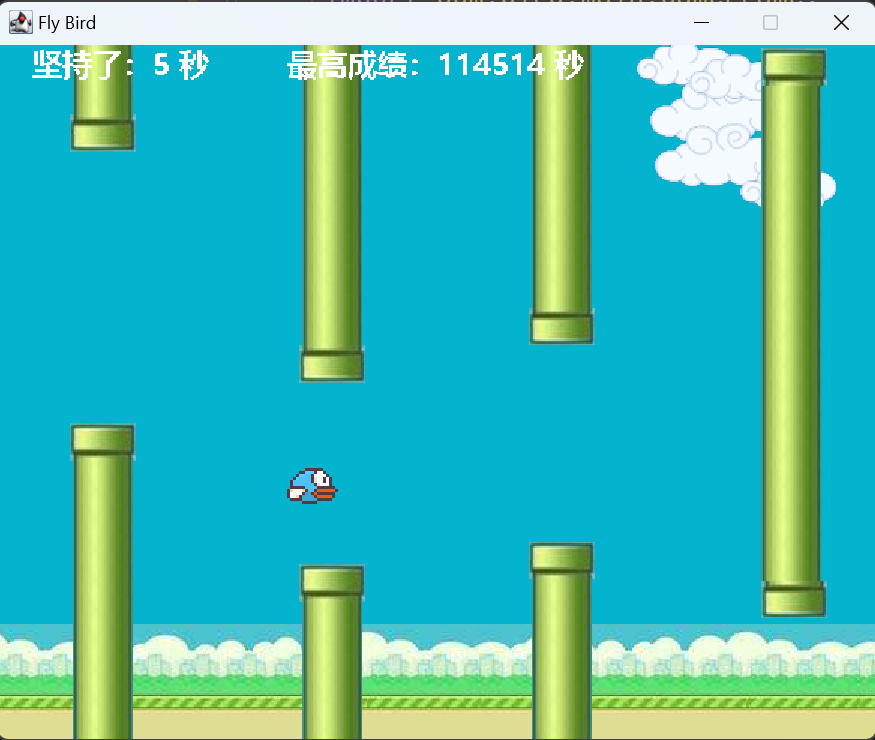
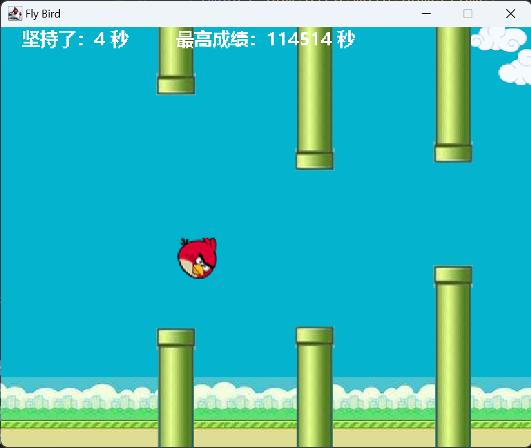
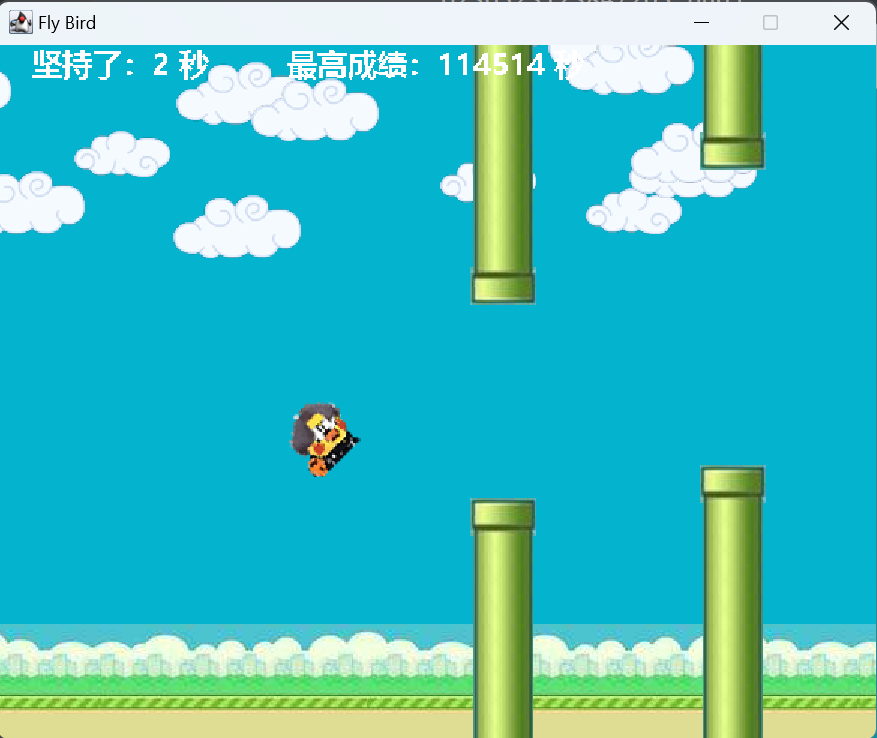
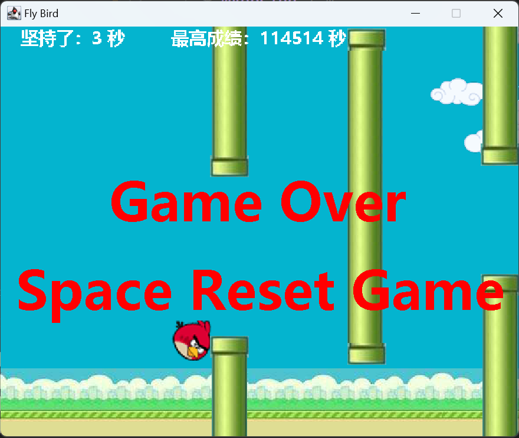

# Fly Bird
## Overview

A simple Fly Bird game done in Java

Optimized the difficulty of the game, you can choose to use the mouse or keyboard control

## How to play

* Run with ``java -jar FlyBird.jar``

* Run the GameApp method in the source code

The game uses the keyboard on the keyboard or mouse operation.

Each game randomly refreshes all the elements, the bird will be gravity will continue to fall, hit the spacebar to make the bird wings upward, the game process requires players to control the bird constantly flying, and pay attention to avoid the randomly generated water pipe, the score is calculated according to the persistence of time, if the flight process hit the water pipe or fall to the ground, the game is over.

## Preview

* Game start

  

* Game over

## Notes

* The text encoding format is UTF-8, please change the text encoding format of the compiler if the comment appears garbled

## Package Contents
### com.bird

#### app

GameApp——Game applications

### main

Barrier--Obstacle class

Barrierpool--Barrierpool class

Bird--Birds class

blueBird--blueBird class

Cloud--clouds class

GameBackGround--game background class

GameBarrierLayer--game barrier class

GameFrame--game frame class

GameFrontGround--game foreground class

GameTime--game time category class

ikunBird--ikunBrid class

redBird--redBird class

## Change Log

v1.3.0 - May 20, 2023

* Optimized the difficulty of the game, changed the way to control the birds, press the Ctrl key on the keyboard to switch to mouse control,Press the Alt key on the keyboard to revert to the keyboard key control.

v1.2.0 - May 18, 2023

* Using abstract classes and inheritance, three forms of birds are added: BlueBird, RedBird, and ikunBird, and the forms can be switched by pressing the 1, 2, or 3 keys on the keyboard.

v1.1.0 - May 11, 2023

* Added intermediate hovering obstacles and obstacles that move up and down.

v1.0.0 - May 10, 2023

* With the basic functions of the game.
